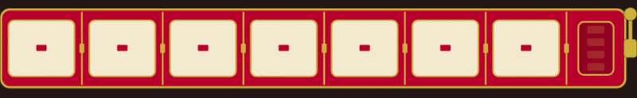
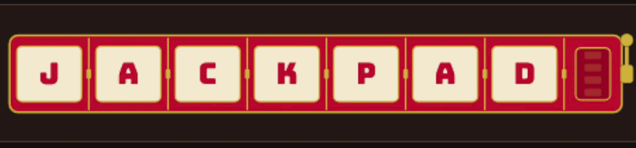

# Jackpad
Jackpad is a modular slot machine macropad. Pull the lever and the slots spin and land on a set of macros for an app, either picked at random or chosen by you. Either way, you get the satisfying mechanical spin of a real slot machine.  Snap on extra slots to make it as big as you need.

Slots detaching / attaching:

## Color theme (3d prints):
Retro chrome

Classic casino

